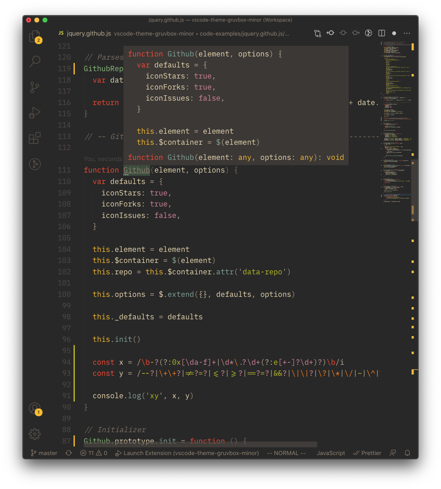

# Gruvbox Minor

A functional Visual Studio Code theme based off of the original
[gruvbox](https://github.com/morhetz/gruvbox) theme and the
Visual Studio Code
[Gruvbox Theme](https://github.com/jdinhify/vscode-theme-gruvbox).
Contains a dark and light mode as well as three sub-modes each,
hard, medium, and soft.

## Screenshot



## Extensions

### Font

The font used in the above preview is [Fantasque Sans Mono](https://github.com/belluzj/fantasque-sans).

### Bracket Pair Colorizer

If you use [Bracket Pair Colorizer](https://marketplace.visualstudio.com/items?itemName=CoenraadS.bracket-pair-colorizer), add the following to your settings for matching colors:

```json
  "bracketPairColorizer.consecutivePairColors": [
    "()",
    "[]",
    "{}",
    [
      "#7c6f64",
      "#a89984",
      "#d5c4a1",
      "#8ec07c",
      "#83a598",
      "#d3869b",
      "#fb4934",
      "#fe8019",
      "#fabd2f",
      "#b8bb26"
    ],
    "#cc241d"
  ],
```

### Indent-rainbow

If you use [indent-rainbow](https://marketplace.visualstudio.com/items?itemName=oderwat.indent-rainbow), add the following to your settings for matching colors:

```json
  "indentRainbow.colors": [
    "rgba(250, 189, 47, 0.05)",
    "rgba(142, 192, 124, 0.05)",
    "rgba(131, 165, 152, 0.05)",
    "rgba(211, 134, 155, 0.05)",
    "rgba(254, 128, 25, 0.05)"
  ],
  "indentRainbow.errorColor": "rgba(251, 73, 52, 0.2)",
```

## PRs are welcomed

### Tips

- In the `json` file, `scope` can be an `array` or a `string`
  of CSS classes
- VSCode's `Developer: Inspect TM Scopes` command is useful
  to find out the scope

### Customization

Customizations and tweaks can be made to all six themes at once by:

1.  Saving the customizations in [tokens](src/theme/tokens) for syntax change,
    and/or [workbench](src/theme/workbench) for editor chrome changes,
2.  Running `npm start`, which builds the TypeScript files and launches a
    program that regenerates the six theme files.

## Thank Yous

Special thanks to the creator of [gruvbox](https://github.com/morhetz/gruvbox)

Thanks to:

- [jdinhify](https://github.com/jdinhify)
- [eximus](https://github.com/3ximus)

who worked on the original VSCode Gruvbox theme that this is based on:

[Gruvbox Theme](https://github.com/jdinhify/vscode-theme-gruvbox)
